<h1 align="center">
	
</h1>
<h1 align="center">
	<b>Sfere</b>
<br>
</h1>
<h2 align="center">
    <em>NLP Solutions for a Digital Earth</em>
</h2>
<br>
<br>
<br>


# Table of Contents

1. [Project Overview](#project-overview)
2. [Data Preparation](#data-preparation)
   1. [Steps](#steps)
   2. [Challenges](#challenges)
3. [Text Normalization](#text-normalization)
   1. [Steps](#steps-1)
   2. [Tools Used](#tools-used)
4. [Feature Extraction](#feature-extraction)
   1. [Named Entity Recognition (NER)](#named-entity-recognition-ner)
      - [Tool Used](#tool-used)
      - [Challenges](#challenges-1)
   2. [Key Phrase Extraction](#key-phrase-extraction)
      - [Tool Used](#tool-used-1)
   3. [Dialogue Extraction](#dialogue-extraction)
      - [Custom Function](#custom-function)
   4. [Data Structuring](#data-structuring)
      - [CSV Creation](#csv-creation)
5. [Model Development](#model-development)
   1. [Building and Training the Keras Model](#building-and-training-the-keras-model)
      - [Training Process](#training-process)
      - [Challenges and Solutions](#challenges-and-solutions)
   2. [Model Metrics: Classification Report](#model-metrics-classification-report)
      - [Interesting Insights](#interesting-insights)
         - [Validation with "Stardust" by Neil Gaiman](#validation-with-stardust-by-neil-gaiman)
         - [Validation with "The Killing Machine" by Jack Vance](#validation-with-the-killing-machine-by-jack-vance)
   3. [Finetuning the GPT2LMHeadModel](#finetuning-the-gpt2lmheadmodel)
      - [Training Process](#training-process-1)
      - [Challenges and Solutions](#challenges-and-solutions-1)
6. [App Creation](#app-creation)
   1. [Streamlit Application](#streamlit-application)
   2. [Features of the App](#features-of-the-app)
      - [Text Processor](#text-processor)
      - [NLP Preprocessor](#nlp-preprocessor)
      - [Interactive Network Graph](#interactive-network-graph)
      - [AI-Driven Text Generation and Analysis](#ai-driven-text-generation-and-analysis)
      - [User Text Analysis](#user-text-analysis)
        - [Challenge](#challenge)
        - [Solution](#solution)
7. [Future Development](#future-development)


## Project Overview

**Objective:** 
Create a Streamlit application incorporating AI and ML technologies to perform
a range of NLP tasks. This application will be capable of data cleaning, summarization,
content generation, information extraction, and analysis, among other
functionalities. While the "Dying Earth" series will serve as the primary data
source for testing and demonstration, the tool is designed to be versatile and
applicable in various real-world scenarios. Its potential uses extend to
business and academic research, legal and healthcare sectors, and general data
organization and analysis. The goal is to showcase how this application can be
adapted and utilized for diverse, practical applications beyond the scope of
the "Dying Earth" series.

[Back to Top](#table-of-contents)

___


## Data Preparation

The initial phase of the project involves the extraction and cleaning of text data from various sources. This step is critical to ensure the quality and consistency of the data fed into the AI models.

### Steps:

1. **Initial Text Extraction:** 
   - Extract text from PDF and ePub files of all four novels in the "Dying Earth" series.
   - Export each novel as individual `.txt` files, in addition to creating a combined `corpus.txt` file.

2. **Additional Text Sources:** 
   - Process and extract texts from other books for comparative analysis and model testing. This includes:
     - "1984" by George Orwell
     - "Into Thin Air" by Jon Krakauer
     - "The Adventures of Tom Sawyer" by Mark Twain
     - "The Killing Machine" by Jack Vance (non-Dying Earth series)

3. **Text Cleaning:** 
   - Address challenges such as:
     - Removal of white spaces, irrelevant chapter names, and page numbers.
     - Standardizing texts from differently formatted PDFs.
   - Ensure that the final text files are clean and consistent for subsequent analysis.

### Challenges:

- Different formatting across PDFs posed a significant challenge, requiring customized cleaning processes for each text source.
- Ensuring the removal of irrelevant data (like headers, footers, page numbers) while retaining all relevant narrative content.

This preparation stage lays the groundwork for accurate and efficient feature extraction, model training, and analysis in later stages of the project.

[Back to Top](#table-of-contents)

___


## Text Normalization

After cleaning the texts, the next step involves text normalization. This process is essential for preparing the data for effective analysis by the AI model.

### Steps:

1. **Tokenization:**
   - Break down the text into individual words or tokens. This helps in analyzing the text at a granular level.

2. **Lemmatization:**
   - Convert words to their base or dictionary form. This process aids in grouping together different forms of the same word, ensuring that they are analyzed as a single item.

3. **Removal of Stop Words:**
   - Eliminate commonly used words (such as 'the', 'is', 'at') that do not contribute to the specific meaning of the text. This step is crucial for focusing the analysis on the more meaningful parts of the text.

### Tools Used:

- **spaCy:** 
  - A powerful and efficient library for advanced Natural Language Processing in Python.
  - Used for tasks like tokenization, lemmatization, and removal of stop words.
  - For more detailed information on spaCy and its capabilities, refer to their official documentation: [spaCy Documentation](https://spacy.io/usage)

This normalization process ensures that the data is in a uniform format, which
is crucial for the accuracy and efficiency of the subsequent modeling and
analysis phases.

[Back to Top](#table-of-contents)

___


## Feature Extraction

For the first book in the "Dying Earth" series, various feature extraction techniques were employed to analyze the text in-depth. This process involved extracting specific elements like named entities, key phrases, and dialogues.

### Named Entity Recognition (NER)

- **Tool Used:** 
  - Stanford's Stanza library for NER.
  - This library is efficient in extracting entities such as people, locations, artifacts/objects, facilities, nationalities, religious or political groups, spells, creatures, and events.
  - For more information on the Stanza library, visit their documentation: [Stanza Documentation](https://stanfordnlp.github.io/stanza/)

#### Challenges:

- **Mislabeling and Duplicates:** 
  - Many entities were initially mislabeled or duplicated.
  - Required manual mapping of entities to their correct types and removal of duplicates.

### Key Phrase Extraction

- **Tool Used:** 
  - NLTK (Natural Language Toolkit) for extracting key phrases.
  - NLTK is a leading platform for building Python programs to work with human language data.
  - Refer to their documentation for more details: [NLTK Documentation](https://www.nltk.org/)

### Dialogue Extraction

- **Custom Function:**
  - Developed a Python function `dialogue_to_df` to extract dialogues from the book.
  - This function used regular expressions to find and isolate dialogue text.

#### Function Code:
```python
def dialogue_to_df(text):
    pattern = r'"([^"]*)"'
    dialogues = re.findall(pattern, text)
    df_dialogues = pd.DataFrame(dialogues, columns=['Dialogue'])
    return df_dialogues
```
### Data Structuring

- **CSV Creation:**
  - Generated multiple CSV files to organize the extracted data:
    1. **Book Content CSV:** 
       - Contains the entire book split by paragraph, with each paragraph in a separate row.
    2. **Named Entities to Paragraphs CSV:** 
       - Links named entities to the paragraphs they appear in, with all named entities contained in a paragraph listed in a column next to it.
    3. **Key Phrases CSV:** 
       - A compilation of key phrases extracted from the text.
    4. **Dialogue CSV:** 
       - Contains all lines of dialogue extracted from the book.
    5. **Named Entities CSV:** 
       - A list of all named entities identified in the text.

This feature extraction stage is pivotal in distilling the text into analyzable
components, setting the stage for detailed analysis and modeling.

[Back to Top](#table-of-contents)

___


## Model Development

A significant aspect of the project involved developing a machine learning model capable of classifying text based on its stylistic alignment with the "Dying Earth" series.

### Building and Training the Keras Model

- **Keras Model:**
  - The model was built using Keras, a high-level neural networks API, specifically utilizing an LSTM (Long Short-Term Memory) model.
  - LSTM models are particularly suited for classification and prediction problems involving sequential data, making them ideal for text analysis tasks.
  - For more detailed information on Keras LSTM models, refer to the [Keras LSTM Documentation](https://keras.io/api/layers/recurrent_layers/lstm/).

This LSTM-based approach provided the necessary framework for handling the complexities of textual data in the "Dying Earth" series, enabling effective pattern recognition and classification.


#### Training Process:

- **Data Utilization:**
  - The model was trained on texts from the "Dying Earth" series and a selection of other books for comparative analysis. These books included:
    - "1984" by George Orwell
    - "Into Thin Air" by Jon Krakauer
    - "The Adventures of Tom Sawyer" by Mark Twain
    - "The Killing Machine" by Jack Vance (non-Dying Earth series)
    - "Cosmos" by Carl Sagan
  - This diverse dataset ensured the model's robustness in identifying stylistic features unique to the "Dying Earth" series.

- **Accuracy Achievement:**
  - Upon training, the model achieved an impressive accuracy of 97%.
  - This high level of accuracy indicates the model's effectiveness in distinguishing the unique literary style of the "Dying Earth" series.

The development and training of this model were pivotal in enabling the text generation and analysis capabilities of the interactive app, forming a cornerstone of the project's success.

#### Model Metrics: Classification Report

The performance of the model was evaluated using key metrics. Below is a table representing the precision, recall, and F1-score for each class, along with the overall accuracy and averages.

| Class/Measure | Precision | Recall | F1-Score | Support |
|---------------|-----------|--------|----------|---------|
| **Class 0 (Not Dying Earth)** | 0.97 | 0.97 | 0.97 | 806 |
| **Class 1 (Is Dying Earth)** | 0.98 | 0.97 | 0.97 | 937 |
| **Accuracy** | | | **0.97** | **1743** |
| **Macro Avg** | 0.97 | 0.97 | 0.97 | 1743 |
| **Weighted Avg** | 0.97 | 0.97 | 0.97 | 1743 |

This table clearly shows the model's high level of precision, recall, and F1-score across both classes, indicating its effective performance in accurately classifying texts.

#### Interesting Insights

##### Validation with "Stardust" by Neil Gaiman

To further evaluate the model's capabilities, a validation test was conducted using "Stardust" by Neil Gaiman, a text stylistically distinct from the "Dying Earth" series. This test was aimed at assessing the model's ability to correctly identify texts that do not align with the "Dying Earth" style.

| Class/Measure | Precision | Recall | F1-Score | Support |
|---------------|-----------|--------|----------|---------|
| **Class 0 (Not Dying Earth)** | 1.00 | 0.81 | 0.90 | 1055 |
| **Class 1 (Is Dying Earth)** | 0.00 | 0.00 | 0.00 | 0 |
| **Accuracy** | | | **0.81** | **1055** |
| **Macro Avg** | 0.50 | 0.41 | 0.45 | 1055 |
| **Weighted Avg** | 1.00 | 0.81 | 0.90 | 1055 |

###### Insights from the Validation Test:

- **Precision for Class 0 (Not Dying Earth)**:
  - The model achieved a precision of 1.00, correctly identifying "Stardust" as not being in the style of "Dying Earth." However, this result was anticipated since "Stardust" inherently does not belong to the "Dying Earth" series. Thus, while this confirms the model's ability to avoid false positives, it doesn't necessarily demonstrate its discernment capabilities between the two classes.

- **Recall for Class 0 (Not Dying Earth)**:
  - A recall rate of 0.81 indicates that the model identified 81% of "Stardust" as "Not Dying Earth." The remaining 19% where the model saw similarities to "Dying Earth" suggests potential areas of overgeneralization or misinterpretation in the model's analysis.

- **F1-Score for Class 0 (Not Dying Earth)**:
  - An F1-Score of 0.90 indicates a strong balance between precision and recall for Class 0. This score reflects the model's overall accuracy in classifying "Stardust" as not being in the "Dying Earth" style.
  - 
- **Absence of Class 1 (Is Dying Earth) Testing**:
  - The test did not include any "Is Dying Earth" instances, limiting the assessment to only one aspect of the model's classification capabilities.

This validation test with "Stardust" not only confirms certain aspects of the model's current strengths but also underscores the necessity for more diverse testing to fully understand and enhance its classification abilities.

##### Validation with "The Killing Machine" by Jack Vance

An additional validation test was conducted using "The Killing Machine" by Jack
Vance, a work outside of the "Dying Earth" series, to assess the model's
ability to recognize Vance's style in different contexts.

| Class/Measure | Precision | Recall | F1-Score | Support |
|---------------|-----------|--------|----------|---------|
| **Class 0 (Not Dying Earth)** | 1.00 | 0.39 | 0.56 | 634 |
| **Class 1 (Is Dying Earth)** | 0.00 | 0.00 | 0.00 | 0 |
| **Accuracy** | | | **0.39** | **634** |
| **Macro Avg** | 0.50 | 0.20 | 0.28 | 634 |
| **Weighted Avg** | 1.00 | 0.39 | 0.56 | 634 |

###### Insights from the Validation Test:

- **Recall for Class 0 (Not Dying Earth)**:
  - A recall rate of 0.39 indicates that only 39% of "The Killing Machine" was identified as "Not Dying Earth." This suggests that a significant portion of the text was either erroneously classified or not confidently classified by the model.

- **F1-Score for Class 0 (Not Dying Earth)**:
  - An F1-Score of 0.56 reflects the balance between the high precision and the lower recall for Class 0 in this test.

- **Overall Model Performance**:
  - The accuracy of 0.39 and the macro average scores indicate that while the model was precise in its classifications, it struggled with identifying a large portion of "The Killing Machine" as distinct from the "Dying Earth" series.

###### Interpretation:

These results indicate that the model is not merely memorizing specific character names and locations, but is recognizing stylistic elements in Jack Vance's writing. However, the model's lower recall suggests it may be conflating some stylistic elements across Vance's different works, highlighting an area for further refinement.

### Finetuning the GPT2LMHeadModel

- **GPT2LMHeadModel:**
  - A pre-trained model from OpenAI was selected for further finetuning.
  - The focus was on aligning it closely with the stylistic elements of the "Dying Earth" saga, adapting it to capture the unique narrative and thematic nuances.
  - For more information on the GPT2LMHeadModel, refer to the [OpenAI GPT-2 Documentation](https://openai.com/research/gpt-2).

This finetuning process was essential in ensuring that the model could effectively generate text that not only resonates with the style of the "Dying Earth" series but also maintains coherence and relevance to the source material.

#### Training Process

- **Finetuning on the Dying Earth Corpus**:
  - The model underwent over 100 epochs of training, specifically targeting the text of the "Dying Earth" series.
  - Training was conducted using a V100 GPU on Google Colab due to the computational intensity of the task.
  - For more information on the GPT2LMHeadModel, refer to the [OpenAI GPT-2 Documentation](https://openai.com/research/gpt-2).

#### Challenges and Solutions

##### Computational Requirements

- **Intensive Training Load**:
  - The training process was too computationally intensive to be performed locally, requiring the use of high-performance cloud computing resources.

##### Generating Satisfactory Text Length

- **Initial Short Outputs**:
  - The initial deployment of the generative text model produced outputs that were shorter than expected and did not meet the desired criteria for length.

- **Attempted Solution with Loops**:
  - An initial solution involved implementing a loop that allowed the model to rerun itself until a minimum text output length was achieved. However, this proved to be too time-consuming due to the computational demands.

- **Final Approach - Training on Larger Text Chunks**:
  - After re-evaluating the data, the model was retrained on larger chunks of text. This approach eventually led to outputs that were more satisfactory in terms of length and quality.

##### Implications:

These challenges and their resolutions highlight the complexities involved in fine-tuning a sophisticated AI model like GPT2LMHeadModel. Adjusting the training data and leveraging high-performance computing resources were key to achieving the desired model behavior.


[Back to Top](#table-of-contents)

___


## App Creation

An interactive application was developed using Streamlit to showcase the findings and capabilities of the project. The app integrates various features for user engagement and data visualization.

### Streamlit Application

- **Streamlit:** 
  - An open-source app framework for Machine Learning and Data Science projects.
  - For more details on Streamlit, visit their documentation: [Streamlit Documentation](https://docs.streamlit.io/)

[Back to Top](#table-of-contents)

___

### Features of the App

#### Text Processor:

The **Text Processor** is an interactive tool designed for efficient document handling. It provides a user-friendly interface for processing and extracting text from PDF documents. The tool offers various functionalities such as paragraph formatting, text manipulation, and content analysis.

- **Uploading a PDF File**:

1. Begin by uploading a PDF file using the provided file uploader.
2. After uploading, the tool displays various options for formatting the PDF file.

- **PDF Processing Options**:

The Text Processor provides users with multiple formatting options to customize the extraction process. Users can choose from the following paragraph formatting options:

- **Format 1:** Joins text blocks, adding paragraphs after periods for well-defined sentence structures.
- **Format 2:** Groups text blocks into paragraphs based on punctuation and capital letters.
- **Format 3:** Enforces paragraph breaks strictly at punctuation marks and at the start of new pages.
- **Format 4:** Uses punctuation for paragraph breaks, omits automatic page breaks, and ignores headers and footers.

Users can further refine the extracted text using a set of checkboxes:

- **Select number of initial pages to skip:** Removes the first n pages from
  the PDF.
- **Select number of initial lines to skip:** Removes the first n lines from
  the PDF.
- **Remove Links:** Eliminates hyperlinks from the text.
- **Remove Chapter Headers:** Removes chapter headers from the text.
- **Expand Contractions:** Expands contractions present in the text.
- **Remove Page Headers:** Eliminates page headers and lines containing only numbers.
- **Remove All Linebreaks:** Replaces all linebreaks with spaces.
- **Remove Section Headers:** Removes Roman numerals at the start of lines and lines starting with 'PART'.
- **Remove Numbers at Start of Sentences:** Eliminates numbers from the beginning of sentences.
- **Remove ALL-CAPS Words:** Converts strings of words in all caps to just the first word capitalized.
- **Remove Words:** Allows users to remove specific words or phrases from the text.
- **Replace Words:** Allows users to replace specific words or sentences with new text.

Users can select multiple processing options to tailor the output according to their needs.

- **Downloading Processed Text**:

Upon completion, the tool provides the option to download the processed text as a `.txt` file.


- **PyMuPDF**: 
  - The Text Processorn incorporates PDF processing functions from the PyMuPDF (fitz) library and includes various text manipulation functions. The tool allows users to dynamically configure processing options, providing a versatile and user-friendly experience.
  - For more details on PyMuPDF, visit their documentation: [PyMuPDF Documentation](https://pymupdf.readthedocs.io/en/latest/)

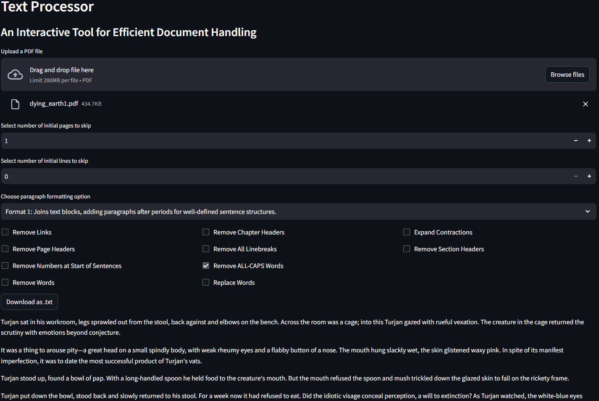

Feel free to explore the capabilities of the Text Processor and enhance your document handling workflow!

[Back to Top](#table-of-contents)

___

#### NLP Preprocessor:

The **NLP Text Processor** is a versatile tool for Natural Language Processing (NLP) tasks, providing a user-friendly interface. This tool facilitates various text processing and analysis functionalities, including tokenization, key phrase extraction, Named Entity Recognition (NER), dependency parsing, and sentiment analysis.

- **Usage:**

  1. Upload a .txt file using the provided file uploader (one processed from
     [Text Processor](#text-processor), or your own).
  2. Utilize the different tabs for specific NLP features:
     - **Text Preview:** Displays the uploaded text.
     - **Tokens:** Download tokenized text as a pickled file.
     - **Key Phrases:** Extracts and visualizes key phrases, with customizable N-grams.
     - **Named Entity Recognition:** Identifies and displays named entities with entity type breakdown.
     - **Dependency Parsing:** Visualizes the dependency tree for selected sentences.
     - **Sentiment Analysis:** Analyzes sentiment polarity and subjectivity, providing insights and visualizations.

- **Text Cleaning:**

  The tool provides a cleaning toggle button allowing users to process the text by tokenizing and lemmatizing, while eliminating stop words and punctuation. Toggle the button to clean the text before applying other NLP features.

    

- **Processing Features:**

  The tool leverages spaCy for comprehensive text processing:

  - **Key Phrase Extraction:**
    - Identifies and visualizes key phrases based on user-defined N-grams.
    - Users can select the number of N-grams to analyze, enabling them to capture multi-word expressions and meaningful phrases within the text.
    - The tool provides a bar chart illustrating the frequency of these key phrases, offering insights into the most significant terms in the document.

      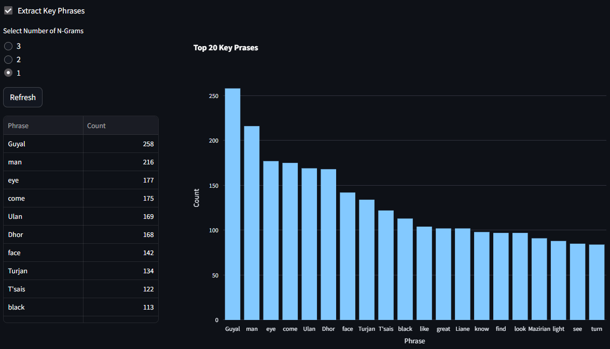

  - **Named Entity Recognition (NER):**
    - Detects and displays named entities within the text.
    - Provides information on entity types (e.g., persons, organizations, locations) for a comprehensive understanding of the document's content.
    - The results are presented in a tabular format, showcasing the identified entities and their respective labels.

      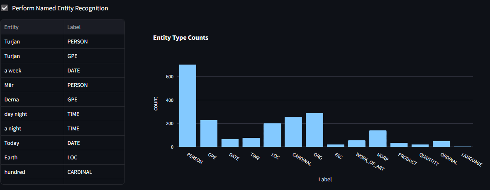

  - **Dependency Parsing:**
    - Visualizes the dependency tree structure for selected sentences.
    - Users can interactively explore the relationships between words, identifying the syntactic dependencies that contribute to the overall meaning of the text.
    - This feature aids in understanding how words relate to each other within a sentence.
  
      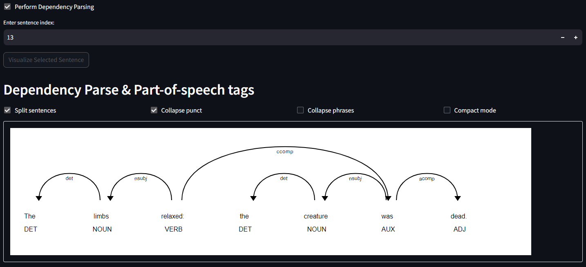

  - **Sentiment Analysis:**
    - Analyzes sentiment polarity and subjectivity of the text.
  
      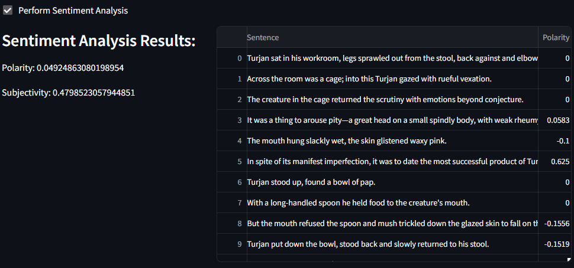

    - The tool provides an overall sentiment analysis result, indicating whether the text expresses a positive, negative, or neutral sentiment.
  
      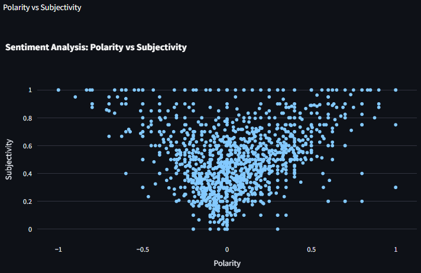

    - Additionally, users can explore the sentiment polarity and subjectivity for each sentence, visualized through scatter and line charts, enhancing the interpretation of sentiment trends throughout the document.
  
      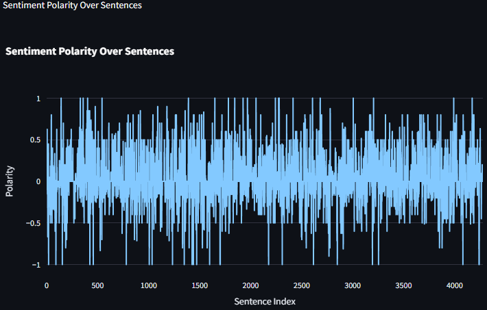

- **Download Option:**

  - Download tokenized text as a pickled file for further analysis.
  

- **Libraries Used:**

  This tool utilizes Python libraries, including:
  - [`pandas`](https://pandas.pydata.org/docs/)
  - [`spacy`](https://spacy.io/api/doc)
  - [`plotly.express`](https://plotly.com/python/plotly-express/)

[Back to Top](#table-of-contents)

___

#### Interactive Network Graph:

- **Visual Exploration**: - Navigate an advanced interactive network graph displaying named entities like 'Person', 'Location', 'Facility', and 'Nationality or Religious or Political group', illustrating their connections.
- **Connection Insights**: Explore the intricate relationships of the narrative universe of Jack Vance through Named Entity Recognition (NER)

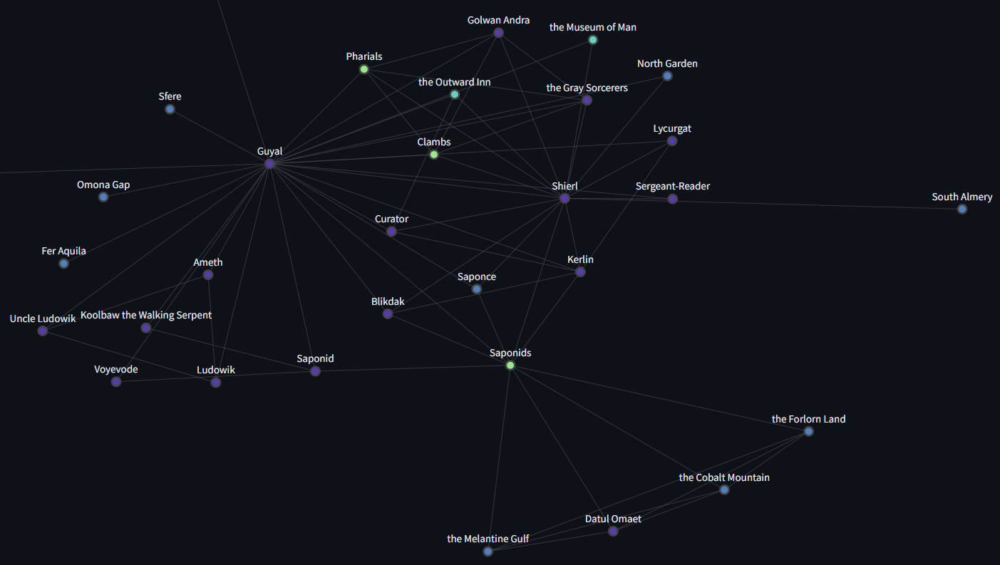

[Back to Top](#table-of-contents)

___

#### AI-Driven Text Generation and Analysis:

- **Dynamic Text Generation**:
  - Leverages a fine-tuned GPT2LMHeadModel for generating narrative text that
    echoes the style of "The Dying Earth" and produces an illustration at the
    push of a button [note: this images are sourced from a folder and not
    instantly AI-generated *yet*]:
  
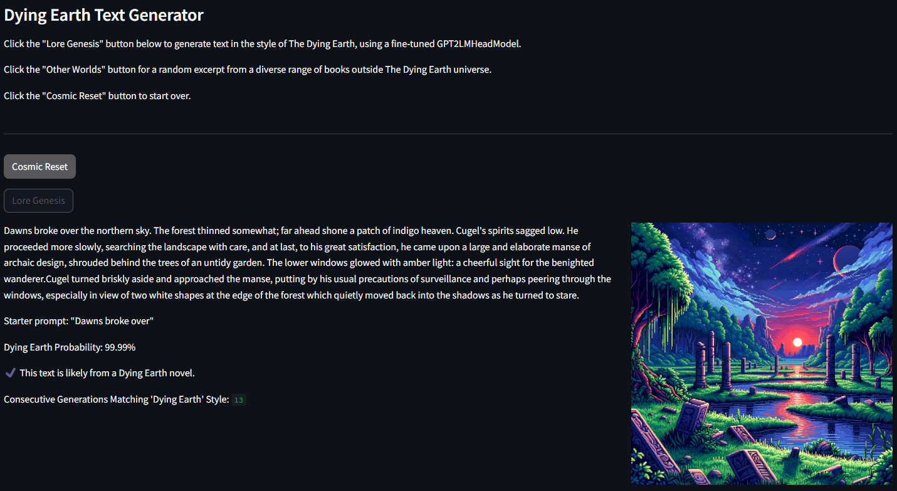

- **Explanation with LIME**:
  - Implements a bar graph using [LIME (Local Interpretable Model-agnostic Explanations)](https://github.com/marcotcr/lime) to display the top ten words from the generated text, sorted by feature importance. This visualization helps users understand which words most influence the stylistic alignment with the series:
  
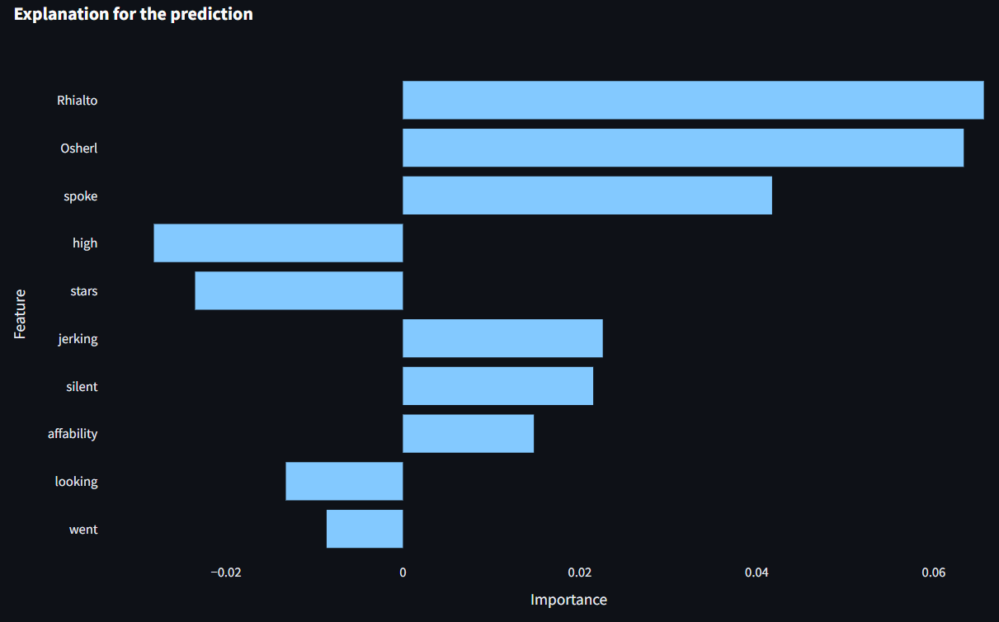

[Back to Top](#table-of-contents)

___

#### User Text Analysis:

- **Engagement with User Creativity**: Users can challenge the AI by submitting
  their own writing to see how closely it aligns (or doesn't) with the "Dying
  Earth" style, or test it on excerpts from different books:
  
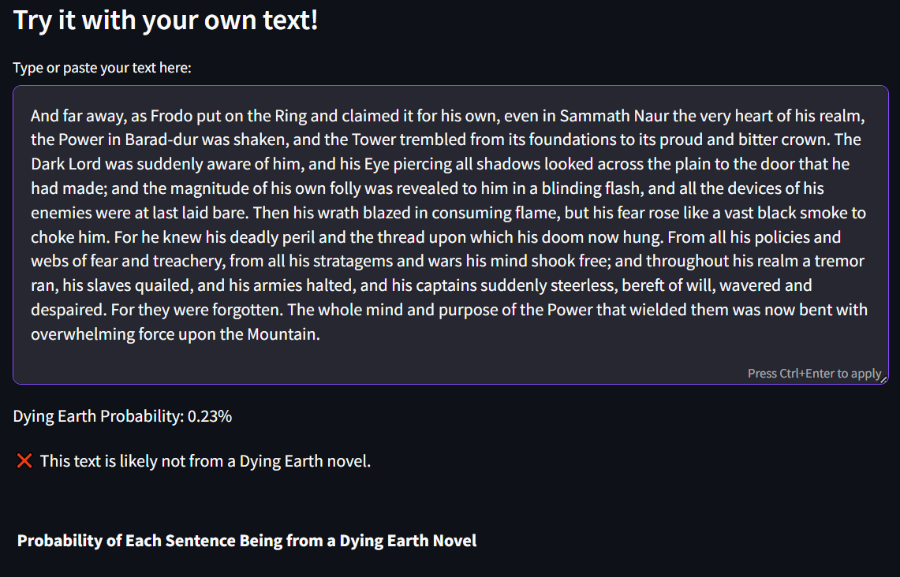

- **Feedback and Learning**: The app offers feedback on stylistic resemblance and a sentence-by-sentence probability breakdown.

Each feature integrates Vance's rich narrative world with AI technology, providing an interactive platform for both literary exploration and the advancement of AI-driven textual analysis:

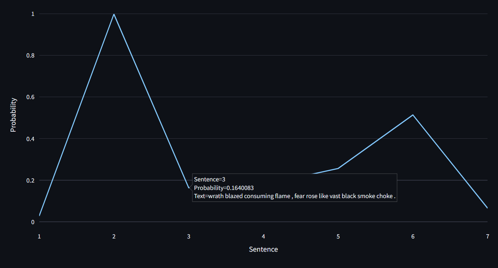

#### ***Challenge:***

- **Generating Randomized Prompts:**
  - The objective was to implement a mechanism for generating seemingly random prompts to feed into the text generation model.
  - Ensuring variety and relevance in the prompts while maintaining a connection to the style of "The Dying Earth."

#### ***Solution:***

- **Utilization of ChatGPT:**
  - Prompted ChatGPT to create a diverse list of 200 starter prompt strings, each consisting of 3-6 tokens.
  - This approach ensured a wide variety of engaging and contextually appropriate prompts.

- **Prompt Storage and Selection:**
  - Stored the generated prompts in a pickled list for efficient retrieval.
  - Implemented a system in the app to randomly select a prompt from this list when initiating text generation.
  - This method allowed for a dynamic and unpredictable user experience, enhancing the interactive nature of the app.

This solution not only addressed the challenge of creating random yet pertinent
prompts but also added an element of surprise and novelty to the user's
experience with the AI-driven text generation feature.

[Back to Top](#table-of-contents)

___

#### Generating Text from Other Books:

- **Challenging the Predictor**:
  - Test the robustness of the AI-driven predictor by providing it with random excerpts from various novels outside "The Dying Earth" series.

Strengthen user engagement with a user-friendly button that generates a random excerpt from a diverse collection of novels:

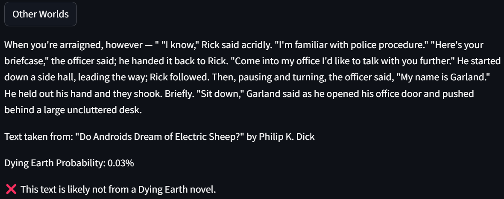

- **Stylistic Analysis**:
  - Leverage the underlying model to analyze the stylistic alignment of the
    randomly generated text, showcasing the model's accurate prediction when
    the provided excerpt does not adhere to the "Dying Earth" series style.

- **Results Interpretation**:
  - Clearly present the results, highlighting the model's proficiency in correctly identifying and distinguishing text that deviates from Vance's writing style.

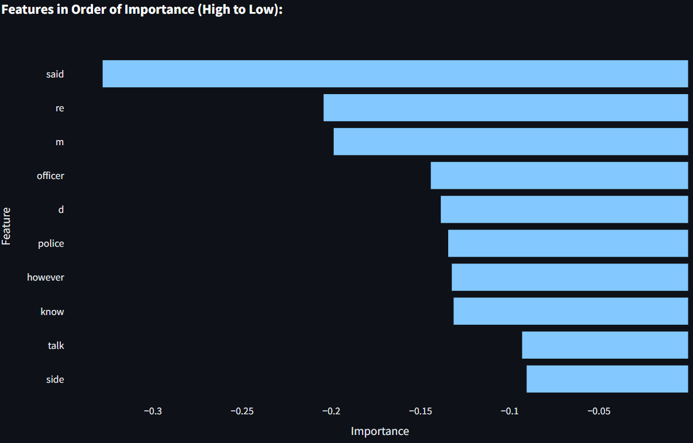

[Back to Top](#table-of-contents)

___

### Future Development

- NER process refinement.
- Image generation in conjunction with text generation.
- Genre detection.
- Sentiment detection.
- Dialogue analysis.
- Document type selection for analysts.
- Robust analysis for niche document categories.
- User experience (UX) testing and feedback.
- Performance optimization strategies.
- Security and data protection compliance.
- Internationalization and localization of the app.
- Community engagement strategies.
- Implementation of analytics and reporting.
- Planning for sustainability and scalability.
- Feature for translating bodies of text into different languages.
- Development of an automated chatbot assistant to help users navigate the app.

[Back to Top](#table-of-contents)